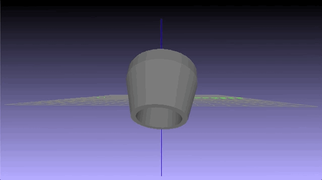

<h1 align="center">Rebel Rae Brown</h1>

    

## About me
|Strong back end developer 🤓
 

Freelancer with great references 💸
 

Ambitious learner 📓
 

ASM nerd and OS dev hobbyist 💻
 

Bash scripting is my secret love ❤️
 

I stole this profile format 🥷🏼
  

## Peep me 👀 on

 

## Tech Stack 🦾

 

## Neat stuff I do/make 🤓

[Java 3D rendering engine](https://github.com/RebelRae/Java-3D-Engine)

> Full Java 3d rendering engine, ongoing project, first editor release soon

[Algorithm visualizer]()

> A step-by-step algorithm visualizer. Good for search, sort, and convex hull problems and more. Comes with sample [Graham Scan]

[Advanced Bash UI and automation](https://github.com/RebelRae/Server-Ops-Automation)

> I'm quite skilled at curses and non-curses based ui tools in my shell scripting

> One of my favorite tools.
>* Runs various async server scripts
>* Multiple user login system
>* Builds, configures, and launches full Node.js apps from templates
>* Configures certificates for any number of subdomains
>* Extremely customizable

[Collision detection 3d raycast spheres](https://thedeviantrebel.com)

> Lots of useful and amusing 3d ai and game tools, including physics and procedural objects

 

## GitHub Stats 😎
